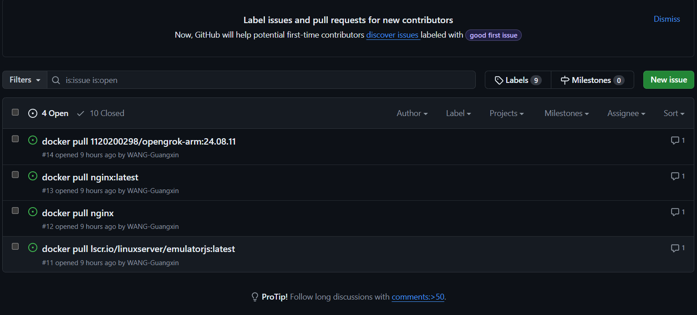
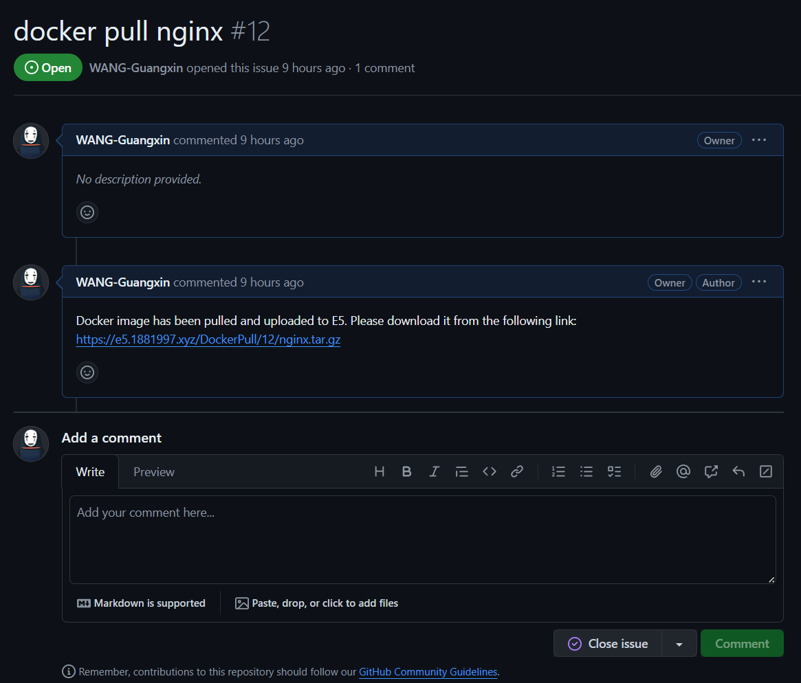

## Docker Pull 🗽

Docker 镜像下载机器人

### 使用方法

为本仓库提交 Issue，标题是你要执行的 docker pull 命令。

例如，你要下载 `nginx` 镜像，issue 标题写 `docker pull nginx`。

耐心等待几分钟，你会收到一个带有下载链接的回复。

点击下载链接，把它下载到本地。

然后执行命令 `docker load < nginx.tar.gz` 即可。

> 如果它帮到你，请给它一个 Star ⭐️
> 
> 有任何问题，欢迎提交 issue.

