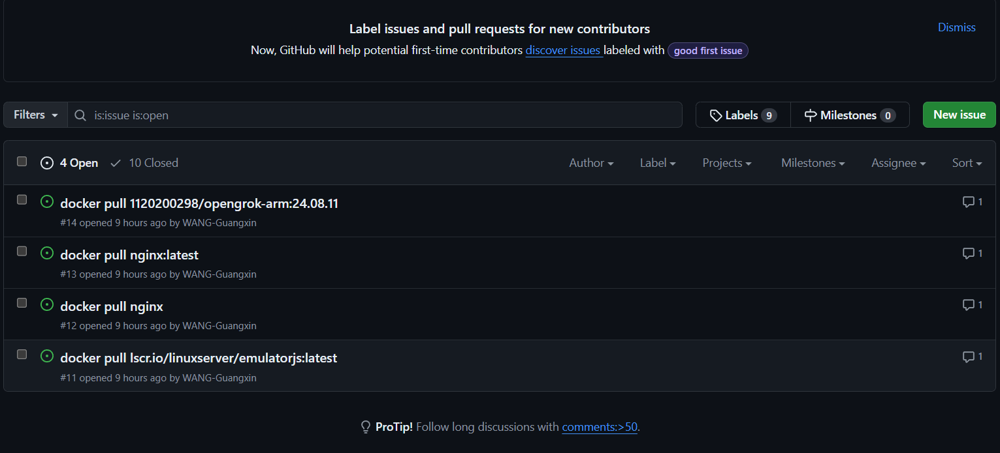
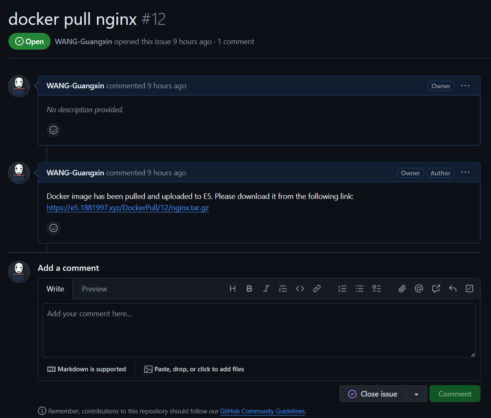

## Docker Pull 🗽

Docker 镜像 / 文件下载机器人

### 使用方法

为本仓库提交 Issue，标题是你要执行的命令。

#### 支持的命令

**1. Docker 镜像下载**
```
docker pull <镜像名>
```
例如：`docker pull nginx:latest`

**2. Wget 下载**
```
wget <URL>
```
例如：`wget https://example.com/file.zip`

**3. Curl 下载**
```
curl <URL>
```
例如：`curl https://example.com/file.zip`



耐心等待几分钟，你会收到一个带有下载链接的回复。



点击下载链接，把它下载到本地。

> 如果它帮到你，请给它一个 Star ⭐️
> 
> 有任何问题，欢迎提交 issue.

